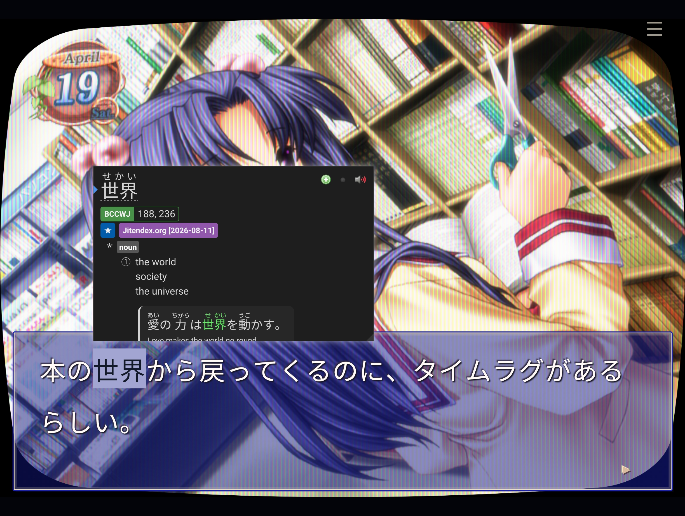
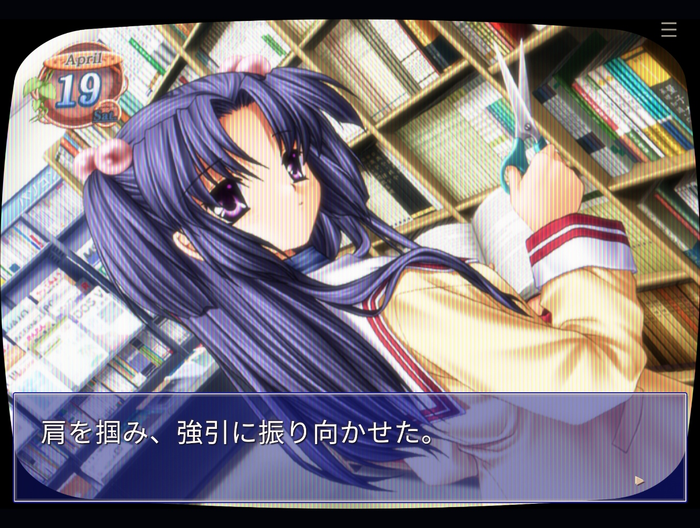
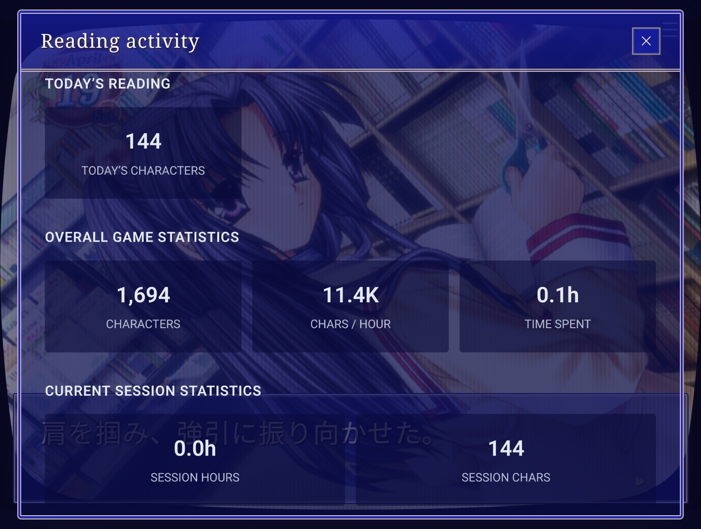
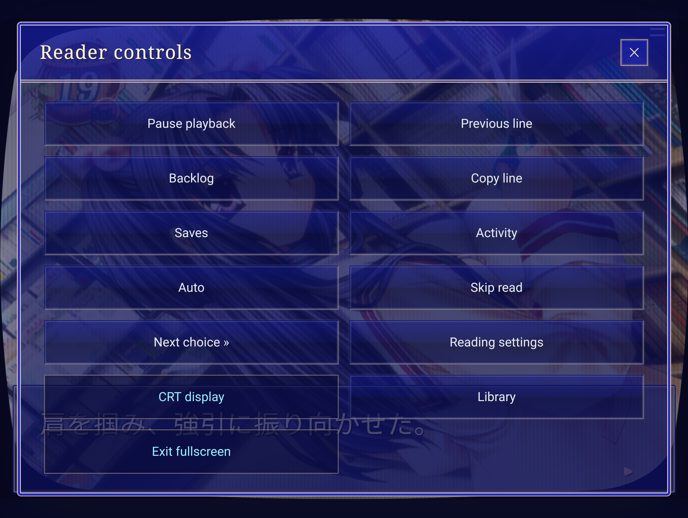
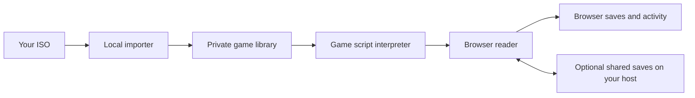

# VN Library

Play Japanese visual novels in your browser, with dictionary lookups, sentence
mining and reading stats. Import your own game ISO on your computer or home
server, then read from your desktop, tablet or phone.

Supports the Japanese PS2 releases of **CLANNAD**, **Remember11** and **Never7**
listed below. No game files are included.

**Early beta:** some animations, effects and extras are missing. Not every route
has been checked against the original games.

A Windows installer with a tray app is available. You can also host the reader
on Linux.

## Bring your own ISO

Supply your own copy of one of these Japanese PS2 releases:

| Game | Disc serial | Version | Import method |
| --- | --- | --- | --- |
| CLANNAD | SLPM-66302 | 1.01 | App or command line |
| Remember11 — the age of infinity | SLPM-65550 | 1.02 | App or command line |
| Never7 — the end of infinity | SLPS-25256 | 1.01 | App or command line |

Never7 is included in the Windows installer and Add game screen. Its ten main good-ending outcomes and
33 extra Append stories have been tested from their starting points to their
endings, including choices, flags and save restoration. This is not a check of
every possible choice sequence or a comparison with original PS2 execution.
Animations, credits and some presentation details remain unfinished.
See [Never7's setup and limits](docs/never7-runtime.md).

Other editions, translations and patched discs are not supported yet. The importer
checks the disc’s contents.

Importing creates a playable copy on your computer or server. Your original ISO
stays unchanged. Once the import finishes, the ISO is no longer needed to play.

The toolkit does not include or download game files.

<details>
<summary>Check your ISO (SHA-256 hashes)</summary>

```text
CLANNAD
35077758488971fc919b2afdadd4e9ebaad48ac67443cf281bbdbfed9bae81e9

Remember11
5cfad772a6d320f2c96c5692e7813a971a045a451e49ba81e3a4402557bd612b

Never7
52759964e8437da516827dc5ca28dc92a15c98940f5b9453131ca028a3b78c8b
```

</details>

## Setup

### Windows setup

1. Download and extract the Windows installer ZIP from Releases.
2. Run **Install.cmd**. Internet access is needed to download the required tools.
3. Open **VN Library** from the Start menu or desktop shortcut. The reader
   opens in your browser.

Closing the app window leaves it running in the system tray. Right-click its tray
icon to open the reader or quit. To start it again after quitting, use the Start
menu or desktop shortcut.

The app uses port **8891** by default. You can change this in the desktop app if
another program on the same computer already uses it.

Games and shared saves are stored in `%LOCALAPPDATA%\VN Import Toolkit`. Updating
or uninstalling the app keeps this folder. Local browser saves and reading stats
stay in your browser.

The Windows installer is currently a test build.

### Linux setup

You can also run the reader on a Linux computer or home server.

You’ll need Python 3.11+, Node.js 22+, FFmpeg/ffprobe and the game’s conversion
tools. The automatic tool setup currently targets Ubuntu 26.04 on x86-64; other
distributions may need manual setup.

Download or clone the project, open a terminal in its folder, then follow the
[CLANNAD setup guide](docs/clannad-import.md) or
[Remember11 setup guide](docs/remember11-import.md).
Never7 uses the same media tools as Remember11; see its [setup guide](docs/never7-runtime.md).

Start the reader:

```sh
python3 -m vnkit serve --port 8891
```

Open **http://127.0.0.1:8891/** in your browser. Keep the terminal running while
importing or playing. If the port is occupied, choose another with `--port`.

Docker Compose is available for serving games you’ve already imported. It does
not include the conversion tools.

### Importing your game

The Add game screen supports all three editions listed above.

1. Open **Library → Add game / Import ISO**.
2. Choose your ISO and click **Add game**.
3. Wait for **Ready to play**, then click **Open game**.

The app copies the ISO to the folder shown on screen, checks the edition and
prepares the game automatically. Your original file stays unchanged.

You can close the import panel while preparation continues, but keep the app or
server running. If something stops, choose **Try again** to reuse the uploaded ISO
and completed work.

The uploaded ISO and temporary conversion files are kept after import. They are
not automatically removed, so allow space for these as well as the finished game.
Conversion requires at least **24 GiB free**, after the upload.

To avoid copying an ISO already on the host, expand **Use an ISO already on the
host** and select it there.

By default, the server lists ISOs in the toolkit folder. To use another folder:

```sh
VNKIT_IMPORT_SOURCE_DIR=/path/to/isos python3 -m vnkit serve --port 8891
```

The CLI is also available. For example:

```sh
python3 -m vnkit inspect '/path/to/Clannad (Japan).iso' --fingerprint
python3 -m vnkit import '/path/to/Clannad (Japan).iso' \
  --adapter clannad-ps2 --work private/clannad \
  --out private/library/clannad
```

Current imports can finish with exit code **3** because presentation support is
incomplete. Read the report: this is different from a conversion failure, which
uses exit code **2**.

[GUI import and recovery](docs/import-gui.md) ·
[CLI and adapter guide](docs/adapters.md)

### Never7

In the Windows app, use **Add game** as above. There are no extra tools to install
for Never7. On Linux, install the media tools described in the
[Never7 guide](docs/never7-runtime.md), then use Add game or the command line:

```sh
python3 -m vnkit import '/path/to/Never7.iso' \
  --adapter never7-ps2 --work private/never7 \
  --out private/library/never7
```

Once prepared, Never7 appears in the same browser library and uses the shared
reader controls, 15 save slots, local/shared saves, stats, text output and display
settings. The clean ISO-to-reader flow is tested on Linux. The updated Windows
installer still needs a full conversion check on a Windows device.

Finishing a route returns to the menu and keeps its unlocks. The original flags
control access to Cure and the Append stories. **Route progress / debug** also
lets you mark main routes complete if you finished them elsewhere.

[Route test results](docs/never7-routes.md) ·
[Read status and shared-save tests](docs/never7-read-status.md)

### Browsers and remote play

Read on a desktop, tablet or phone. Firefox and Chromium have automated reader
tests; Safari and iOS have not been verified.

For access away from home, **Tailscale** is suggested. Install it on the computer
hosting the reader and the devices you want to read on, then configure
**Tailscale Serve** to give the reader a private HTTPS address.

Use that same address on each device. The host computer must stay running while
you play.

HTTPS also allows browser features such as clipboard access when connecting
remotely. Dictionary extensions depend on your browser and device.

See the [remote access guide](docs/remote-access.md) for setup.

### Local and shared saves

Choose **Saves → Save location** for each game:

- **Local:** saves stay in the browser you’re using. This is the default.
- **Shared:** saves and route progress are stored on the computer hosting the
  reader, so you can continue on another device.

To share saves, use the same server address and select **Shared** on each device.
Local and shared saves stay separate.

There are **15 manual save slots**, plus autosave. Saves can be deleted, exported
and imported. A backup is also made before skipping to the next choice.

Reading stats and display preferences stay on each device. Loading an earlier
save does not erase your reading history.

Export saves, route progress and activity from their menus to keep backups.
Clearing browser data can remove local saves and stats.

## Lookups and mining



Use [Yomitan](https://github.com/yomidevs/yomitan) or another browser dictionary
directly on the Japanese text. Looking up words and selecting text won’t advance
the story.

Yomitan can create Anki cards with the usual dictionary setup. The reader itself
does not attach screenshots or sentence audio.

For external tools, enable **Publish newly presented text** in settings. This
provides a **WebSocket stream** of dialogue as it appears. Plain text and JSON
formats are available, including compatibility with
[Renji’s Texthooker UI](https://github.com/Renji-XD/texthooker-ui).

[GameSentenceMiner](https://github.com/bpwhelan/GameSentenceMiner) can use a
WebSocket text source alongside its capture tools and overlay. This workflow has
not yet been tested with the reader.

[Hachidori](https://github.com/bee-san/hachidori) can provide screenshots when
mining through the browser. It has worked intermittently in testing with this
reader, but is still under development.

**Live text** opens a separate page showing encountered dialogue. You can also
copy the current line with **Alt+C**, or enable automatic copying.

## Customisation and bonuses



- **CRT filters:** six presets, with adjustable scanlines, phosphor masks, glow,
  curvature and colour.
- **Text and UI:** adjust textbox colour and opacity, font size, line spacing
  and text speed.
- **Display:** light or dark surroundings and fullscreen reading.
- **Audio:** separate music, voice and sound-effect volumes.
- **Sound test:** listen to the game’s music outside a playthrough.
- **Menu music:** background music while browsing menus, with its own mute and
  volume controls.

Display and audio preferences stay on each device. CRT filters are optional;
importing does not upscale the original artwork.

## Stats



Reading stats take inspiration from
[GameSentenceMiner](https://github.com/bpwhelan/GameSentenceMiner) and
[Renji’s Texthooker UI](https://github.com/Renji-XD/texthooker-ui).

Track today’s characters, total characters, active reading time, characters per
hour, unique text and rereading.

Breaks shorter than four hours stay within the same session. A reading day starts
at **04:01 local time**.

You can pause tracking, reset the current session, delete individual sessions
and export your history as CSV or JSON.

Skipped dialogue does not increase reading totals. Refreshing or loading a save
does not count the current line again. Stats stay separate from saves, so loading
an earlier position does not erase later activity.

## Reader controls



| Control | What it does |
| --- | --- |
| Click/tap the artwork, ▸, Space, Enter or → | Advance |
| Previous line / Alt+← | Return to an earlier line from the current session |
| Auto | Advance automatically, allowing voices to finish |
| Skip read | Skip previously read text; stop at choices or unread text |
| Next choice / Alt+N | Skip forward to the next choice, including unread text |
| Pause | Pause playback, music and reading activity |
| Backlog | Search encountered text and replay associated voices |
| Route progress / debug | Mark routes complete if you finished them elsewhere |

**Esc** cancels a Next choice jump. Previous-line history clears when you reload
the page or load a save.

Manually marking a route complete does not add reading stats. Where a verified
route path is available, its text is also marked as read. Alternate branches are
not all assumed read.

Never7's optional completed-route read paths must be built locally; they are not
bundled with the code. Ordinary Skip read works without them. See the
[read-path guide](docs/never7-read-status.md).

## Roadmap

The next PS2 games planned for investigation are:

- AIR
- Tomoyo After
- planetarian
- Ever17
- Memories Off series

Other platforms of interest: **PSP, PS Vita, PC-98 and Dreamcast**.

These games and platforms are not supported yet. Existing import and engine code
will be reused where compatible.

Ongoing work also includes animations, presentation fixes, easier installation
and broader testing. Never7's remaining work includes presentation details and
native Windows testing.

## Architecture

VN Library has two parts: a local importer that prepares the game, and a browser
reader that runs its story. The Windows tray app starts the same local server
used on Linux.



The importer checks the edition, extracts resources and converts media where
needed. It records source locations and fingerprints so a failed import can be
checked and resumed. Finished games no longer need the ISO to run.

The browser's game adapter follows the original script instructions: choices,
conditions, variables, calls and endings. It sends text, scenes and media to the
shared reader. Each game keeps its own instruction handling; a matching archive
format does not mean two games run the same scripts. Unknown state-changing
instructions stop with an error.

| Location | What it does |
| --- | --- |
| `vnkit/disc.py`, `vnkit/source.py` | Read discs and extract files safely |
| `vnkit/adapters/` | Identify exact editions and prepare their scripts and media |
| `web/adapters/` | Execute each game's story and keep its state |
| `web/` | Reader controls, graphics, text, audio, saves and reading activity |
| `vnkit/server.py`, `vnkit/import_jobs.py` | Serve the library and run import jobs |
| `windows/` | Installer, tray app and pinned tool setup |
| `fixtures/synthetic/`, `tests/` | Original test game and automated checks |

Game data, saves and reading history stay outside the distributed code. Activity
history is separate from story saves, so loading an old position does not undo
later reading. New games reuse the reader and any proven compatible extraction
tools; they still need their own edition checks and execution tests.

For the interfaces and format details, see the [adapter guide](docs/adapters.md),
[content format](docs/adapters.md#current-content-contract) and [testing guide](docs/testing.md).

## Contributing — people and AI agents

Contributions are welcome for every part of the project: documentation, tests,
reader features, safety fixes, import tooling and edition-specific adapters. You
can work by hand or with any coding agent; no particular AI service is required.
The [contributor workflow](docs/contributor-workflow.md) gives a tool-neutral
starting point and a copyable agent prompt.

Any lawful PS2 ISO can be proposed for investigation. Each contribution is scoped
to its exact platform and edition: fingerprint/research and safe static recovery
are useful outcomes, while browser-playable support requires source-driven
execution and evidence. An ISO is never assumed supported merely because it is a
PS2 disc, has familiar filenames or shares a publisher/engine label.

Start with [Contributing](CONTRIBUTING.md). For ISO or adapter work, use the
[new-game proposal](.github/ISSUE_TEMPLATE/new-game-proposal.yml) and read the
[adapter contribution guide](docs/adapter-contributions.md). Public checks and
the pull-request workflow run without a commercial game disc.

## Development, licence and credits

Original code is released under the [MIT licence](LICENSE). Third-party tools
and music retain their own licences. Game content is not included or covered by
the toolkit’s licence.

The project includes import tools, game adapters, an original test game and a
[reusable Codex skill](.agents/skills/vn-import/SKILL.md). The skill is optional;
people and any coding agent can follow the public contributor workflow.

Inspired by [Tsukiweb](https://github.com/requinDr/tsukiweb-public),
[Renji’s Texthooker UI](https://github.com/Renji-XD/texthooker-ui) and
[GameSentenceMiner](https://github.com/bpwhelan/GameSentenceMiner). Credits for
reused code and conversion tools are listed in the
[third-party notices](third_party/).

**Menu music:** “Nova Mistero” by **virabelo**, from
[Free Music Archive](https://freemusicarchive.org/music/virabelo/nova-mistero),
licensed under [CC BY 4.0](https://creativecommons.org/licenses/by/4.0/).
The recording is unchanged.

## AI usage

This project was developed with substantial assistance from OpenAI Codex. AI
assistance was used to investigate file formats, write and debug code, build the
interface, create tests and draft documentation. The project owner directed the
work, tested builds and reviewed the interface and documentation.

AI is not used to generate or translate the game’s dialogue, artwork, music or
voices. Those come from the supplied game files. The importer and reader do not
need an AI service to run.

AI-assisted development does not guarantee accuracy. Known limitations and test
coverage are documented, and comparisons with the original games remain
incomplete.
