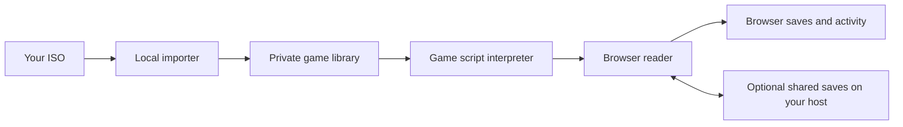

# Architecture

VN Library has two parts: a local importer that prepares the game, and a browser
reader that runs its story. The Windows tray app starts the same local server
used on Linux.

The importer checks the edition, extracts resources and converts media where
needed. It records source locations and fingerprints so a failed import can be
checked and resumed. Finished games no longer need the ISO to run.

The browser's game adapter follows the original script instructions: choices,
conditions, variables, calls and endings. It sends text, scenes and media to the
shared reader. Each game keeps its own instruction handling; a matching archive
format does not mean two games run the same scripts. Unknown state-changing
instructions stop with an error.

| Location | What it does |
| --- | --- |
| `vnkit/disc.py`, `vnkit/source.py` | Read discs and extract files safely |
| `vnkit/adapters/` | Identify exact editions and prepare their scripts and media |
| `web/adapters/` | Execute each game's story and keep its state |
| `web/` | Reader controls, graphics, text, audio, saves and reading activity |
| `vnkit/server.py`, `vnkit/import_jobs.py` | Serve the library and run import jobs |
| `windows/` | Installer, tray app and pinned tool setup |
| `fixtures/synthetic/`, `tests/` | Original test game and automated checks |

Game data, saves and reading history stay outside the distributed code. Activity
history is separate from story saves, so loading an old position does not undo
later reading. New games reuse the reader and any proven compatible extraction
tools; they still need their own edition checks and execution tests.

For the interfaces and format details, see the [adapter guide](adapters.md),
[content format](adapters.md#current-content-contract) and [testing guide](testing.md).
