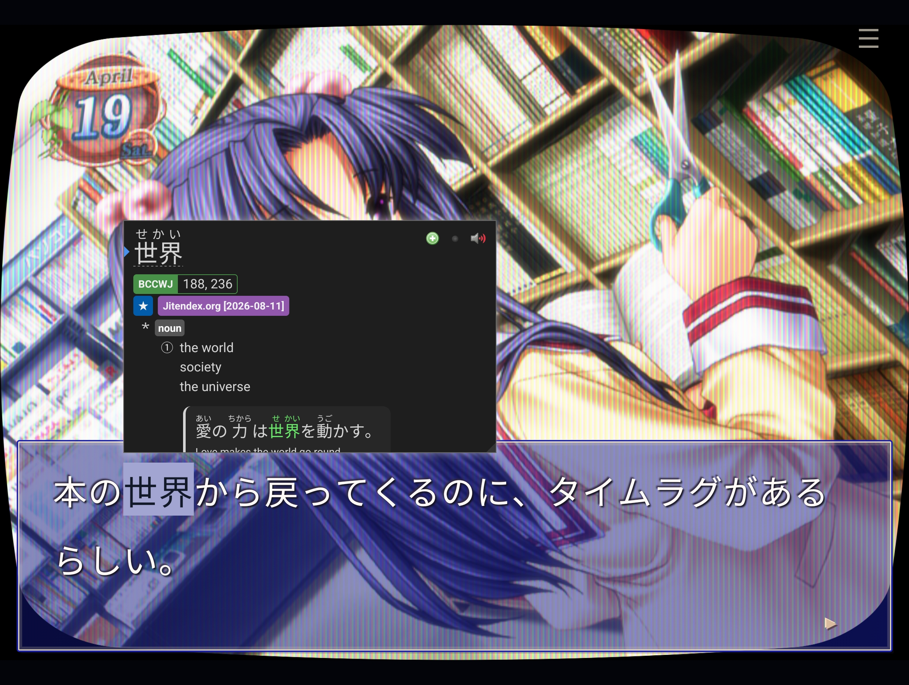
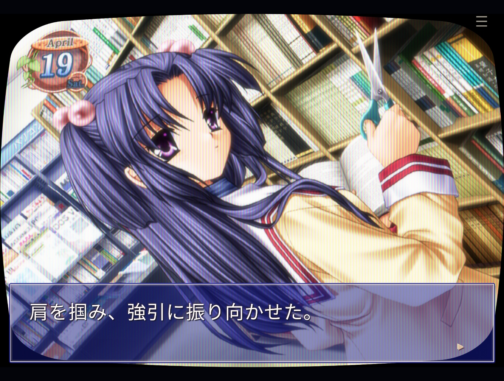
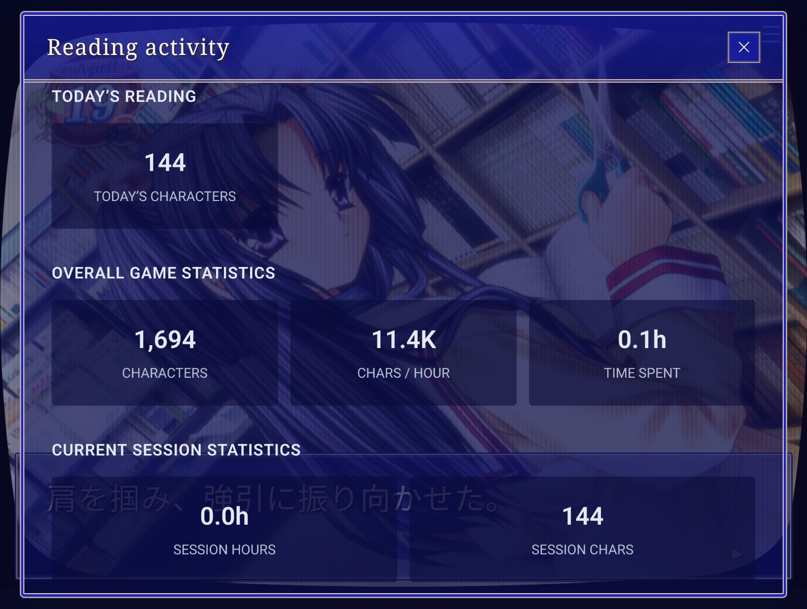
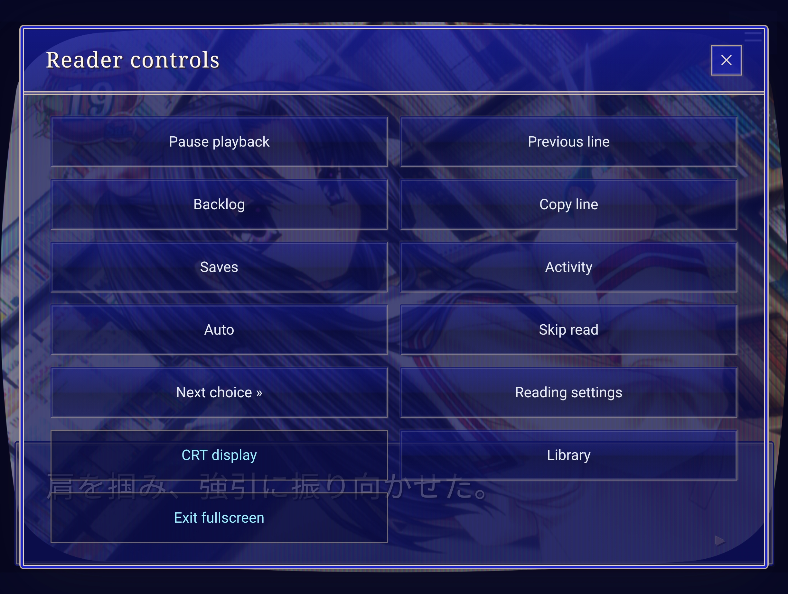

# Using VN Library

## Browsers and remote play

Read on a desktop, tablet or phone. Firefox and Chromium have automated reader
tests; Safari and iOS have not been verified.

For access away from home, **Tailscale** is suggested. Install it on the computer
hosting the reader and the devices you want to read on, then configure
**Tailscale Serve** to give the reader a private HTTPS address.

Use that same address on each device. The host computer must stay running while
you play.

HTTPS also allows browser features such as clipboard access when connecting
remotely. Dictionary extensions depend on your browser and device.

See the [remote access guide](remote-access.md) for setup.

### Local and shared saves

Choose **Saves → Save location** for each game:

- **Local:** saves stay in the browser you’re using. This is the default.
- **Shared:** saves and route progress are stored on the computer hosting the
  reader, so you can continue on another device.

To share saves, use the same server address and select **Shared** on each device.
Local and shared saves stay separate. **Save location → Copy saves** can replace
either bank with the other, including route progress. Copying asks for confirmation
and keeps a backup of the destination; reading activity stays on each device.

There are **15 manual save slots**, plus autosave. Saves can be deleted, exported
and imported. A backup is also made before skipping to the next choice.

Reading stats and display preferences stay on each device. Loading an earlier
save does not erase your reading history.

Export saves, route progress and activity from their menus to keep backups.
Clearing browser data can remove local saves and stats.

## Lookups and mining

Use [Yomitan](https://github.com/yomidevs/yomitan) or another browser dictionary
directly on the Japanese text. Looking up words and selecting text won’t advance
the story.

Yomitan can create Anki cards with the usual dictionary setup. Optional
**[Anki media support](anki.md)** adds the scene image and original voice
clip when you click Add. It uses the game’s assets directly, with a small
desktop Anki add-on. No screen recording is needed.

Download the add-on from **Reading settings → Anki media**, install it in Anki,
and set Yomitan’s AnkiConnect address to **http://127.0.0.1:8776**. AnkiConnect
itself stays on **8765**. Enable Anki media in the reader and wait for
**Anki: ready** before opening a word lookup. The setup guide covers note fields
and card templates. The newer **media add-on 0.2.0** also supports mining on a
phone into desktop Anki through Tailscale HTTPS; see
[phone setup](anki.md#mine-on-a-phone-add-cards-on-a-computer).
Current releases include this add-on. If you installed the earlier 0.1.0
add-on, download it again from the updated reader and reinstall it in Anki.
Unvoiced lines get an image only; backlog and Live text mining are not supported
yet. Media added to Anki follows your Anki sync settings.

For external tools, enable **Publish newly presented text** in settings. This
provides a **WebSocket stream** of dialogue as it appears. Plain text and JSON
formats are available, including compatibility with
[Renji’s Texthooker UI](https://github.com/Renji-XD/texthooker-ui).

[GameSentenceMiner](https://github.com/bpwhelan/GameSentenceMiner) can use a
WebSocket text source alongside its capture tools and overlay. This workflow has
not yet been tested with the reader.

[Hachidori](https://github.com/bee-san/hachidori) can provide screenshots when
mining through the browser. It has worked intermittently in testing with this
reader, but is still under development.

**Live text** opens a separate page showing encountered dialogue. You can also
copy the current line with **Alt+C**, or enable automatic copying.

## Customisation and bonuses

- **CRT filters:** six presets, with adjustable scanlines, phosphor masks, glow,
  curvature and colour.
- **Text and UI:** adjust textbox colour and opacity, font size, line spacing
  and text speed.
- **Display:** light or dark surroundings and fullscreen reading.
- **Audio:** separate music, voice and sound-effect volumes.
- **Sound test:** listen to the game’s music outside a playthrough.
- **Menu music:** background music while browsing menus, with its own mute and
  volume controls.

Display and audio preferences stay on each device. CRT filters are optional;
importing does not upscale the original artwork.

## Stats

Reading stats take inspiration from
[GameSentenceMiner](https://github.com/bpwhelan/GameSentenceMiner) and
[Renji’s Texthooker UI](https://github.com/Renji-XD/texthooker-ui).

Track today’s characters, total characters, active reading time, characters per
hour, unique text and rereading.

Breaks shorter than four hours stay within the same session. A reading day starts
at **04:01 local time**.

You can pause tracking, reset the current session, delete individual sessions
and export your history as CSV or JSON.

Skipped dialogue does not increase reading totals. Refreshing or loading a save
does not count the current line again. Stats stay separate from saves, so loading
an earlier position does not erase later activity.

## Reader controls

| Control | What it does |
| --- | --- |
| Click/tap the artwork, ▸, Space, Enter or → | Advance |
| Previous line / Alt+← | Return to an earlier line from the current session |
| Auto | Advance automatically, allowing voices to finish |
| Skip read | Skip previously read text; stop at choices or unread text |
| Next choice / Alt+N | Skip forward to the next choice, including unread text |
| Pause | Pause playback, music and reading activity |
| Backlog | Search encountered text and replay associated voices |
| Route progress / debug | Mark routes complete if you finished them elsewhere |

**Esc** cancels a Next choice jump. Previous-line history clears when you reload
the page or load a save.

Manually marking a route complete does not add reading stats. Where a verified
route path is available, its text is also marked as read. Alternate branches are
not all assumed read.

Never7's optional completed-route read paths must be built locally; they are not
bundled with the code. Ordinary Skip read works without them. See the
[read-path guide](never7-read-status.md).
